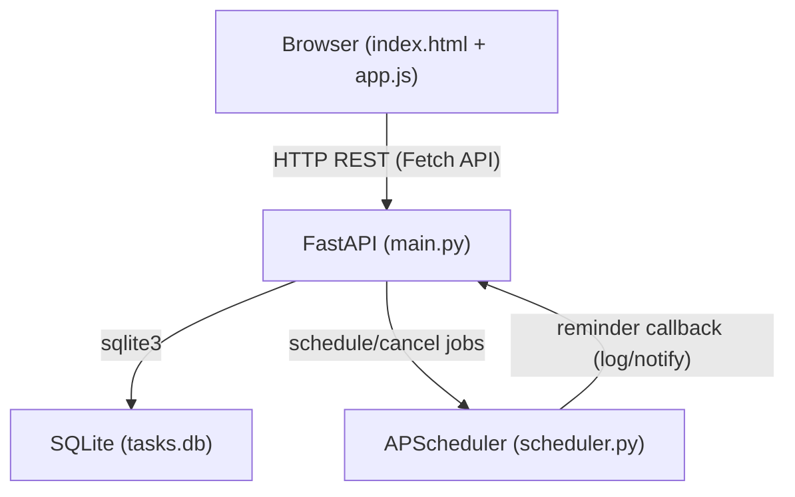

# Design Document: todo-app

## Overview

The todo-app is a browser-based task manager with a Python FastAPI backend and a plain HTML5/vanilla JS frontend. The backend exposes a REST API, persists tasks in SQLite, and manages scheduled reminders via APScheduler. The frontend is served as static files directly by FastAPI and communicates with the backend exclusively through the REST API using the Fetch API.

The architecture is intentionally simple: a single-process Python application with no external services, suitable for local/self-hosted use.

---

## Architecture



Request flow:
1. Browser loads `index.html` from `GET /`
2. `app.js` fetches tasks from `GET /tasks` on page load
3. User actions (create, update, delete, complete, set reminder) trigger `fetch()` calls to the API
4. FastAPI route handlers delegate to helper functions in `database.py` and `scheduler.py`
5. Responses are serialised as JSON using Pydantic models and returned to the browser

---

## Components and Interfaces

### `main.py` — FastAPI Application & Routes

Mounts `StaticFiles` at `/static` and serves `index.html` at `/`. Defines all API route handlers. Route handlers are thin: they validate input via Pydantic, call helpers, and return responses.

| Method | Path | Description |
|--------|------|-------------|
| GET | `/` | Serve `static/index.html` |
| GET | `/tasks` | List all tasks |
| POST | `/tasks` | Create a task |
| PUT | `/tasks/{task_id}` | Update a task |
| DELETE | `/tasks/{task_id}` | Delete a task |
| POST | `/tasks/{task_id}/complete` | Toggle completion status |
| POST | `/tasks/{task_id}/reminder` | Set or update a reminder |

### `models.py` — Pydantic Models

Defines request and response schemas used for validation and serialisation.

- `TaskCreate` — request body for task creation (`title: str`, `description: str | None`)
- `TaskUpdate` — request body for task update (`title: str`, `description: str | None`)
- `ReminderRequest` — request body for setting a reminder (`remind_at: datetime`)
- `TaskResponse` — full task representation returned by all endpoints

### `database.py` — SQLite Helpers

Manages the SQLite connection and exposes CRUD helper functions. Schema is initialised on startup if absent.

Functions: `init_db()`, `create_task()`, `get_all_tasks()`, `get_task()`, `update_task()`, `delete_task()`, `set_reminder()`.

### `scheduler.py` — APScheduler Reminder Management

Wraps an `APScheduler BackgroundScheduler` instance. Exposes functions to add, replace, and cancel one-time reminder jobs keyed by `task_id`.

Functions: `start_scheduler()`, `schedule_reminder(task_id, remind_at, callback)`, `cancel_reminder(task_id)`.

### `static/` — Frontend

- `index.html` — page structure, task creation form (title + description only, no reminder input), task list container
- `app.js` — all Fetch API calls, DOM manipulation, event listeners; reminder time displayed conditionally on task cards; editing (title, description, reminder) accessible only via Edit button/form
- `style.css` — minimal styling; completed tasks visually distinguished (e.g. strikethrough); task card layout: title, reminder time, and action controls share the same row; description renders on the row below

---

## Data Models

### Database Schema

```sql
CREATE TABLE IF NOT EXISTS tasks (
    id          INTEGER PRIMARY KEY AUTOINCREMENT,
    title       TEXT    NOT NULL,
    description TEXT,
    completed   INTEGER NOT NULL DEFAULT 0,   -- 0 = false, 1 = true
    remind_at   TEXT                           -- ISO 8601 datetime string, nullable
);
```

### Pydantic Models

```python
# Request: create
class TaskCreate(BaseModel):
    title: str          # must be non-empty (validated with @field_validator)
    description: str | None = None

# Request: update
class TaskUpdate(BaseModel):
    title: str          # must be non-empty
    description: str | None = None

# Request: set reminder
class ReminderRequest(BaseModel):
    remind_at: datetime  # must be in the future (validated with @field_validator)

# Response: all endpoints return this shape
class TaskResponse(BaseModel):
    id: int
    title: str
    description: str | None
    completed: bool
    remind_at: datetime | None
```

### Validation Rules

- `title` — stripped of surrounding whitespace; rejected (HTTP 422) if empty after stripping
- `remind_at` — rejected (HTTP 422) if not strictly greater than `datetime.utcnow()`
- Missing/unknown task IDs — HTTP 404 with descriptive message
- Wrong field types — HTTP 422 with field-level detail (FastAPI/Pydantic default behaviour)

---


## Correctness Properties

*A property is a characteristic or behavior that should hold true across all valid executions of a system — essentially, a formal statement about what the system should do. Properties serve as the bridge between human-readable specifications and machine-verifiable correctness guarantees.*

### Property 1: Task creation round-trip

*For any* non-empty title string and optional description, creating a task via `POST /tasks` and then fetching it via `GET /tasks/{id}` should return a task with the same title, description, `completed=false`, and a unique integer ID.

**Validates: Requirements 1.1**

---

### Property 2: Empty/whitespace title is rejected on create and update

*For any* string composed entirely of whitespace characters (including the empty string), submitting it as the `title` field to `POST /tasks` or `PUT /tasks/{id}` should result in an HTTP 422 response, and the database state should be unchanged.

**Validates: Requirements 1.2, 3.3**

---

### Property 3: GET /tasks returns all persisted tasks

*For any* sequence of task creation operations, `GET /tasks` should return a JSON array containing exactly all tasks that have been created and not yet deleted, with no omissions or additions.

**Validates: Requirements 2.1**

---

### Property 4: Frontend renders all task fields

*For any* task returned by the API, the rendered DOM element for that task should contain the task's title, description (if present), and completion status indicator. If `remind_at` is set, the reminder time SHALL be displayed in the same row as the title and controls; if not set, no reminder time element SHALL be present. The description SHALL appear on a separate row below the title row.

**Validates: Requirements 2.2, 2.3, 2.4**

---

### Property 5: Task update round-trip

*For any* existing task and any valid update payload (non-empty title), submitting `PUT /tasks/{id}` and then fetching the task should return a task reflecting the updated values.

**Validates: Requirements 3.1**

---

### Property 6: Non-existent task ID returns HTTP 404

*For any* task ID that does not exist in the database, submitting a `PUT`, `DELETE`, `POST .../complete`, or `POST .../reminder` request for that ID should return an HTTP 404 response with a descriptive error message.

**Validates: Requirements 3.2, 4.2, 6.3**

---

### Property 7: Delete removes task from database

*For any* existing task, after a successful `DELETE /tasks/{id}`, a subsequent `GET /tasks` should not include that task, and `GET /tasks/{id}` should return HTTP 404.

**Validates: Requirements 4.1**

---

### Property 8: Deleting a task cancels its reminder job

*For any* task that has an active reminder registered with the scheduler, deleting the task via `DELETE /tasks/{id}` should result in the scheduler having no job associated with that `task_id`.

**Validates: Requirements 4.4**

---

### Property 9: Completion toggle is an involution (round-trip)

*For any* existing task, toggling its completion status twice (via two `POST /tasks/{id}/complete` requests) should return the task to its original `completed` value.

**Validates: Requirements 5.1**

---

### Property 10: Completed tasks are visually distinguished in the frontend

*For any* task with `completed=true`, the DOM element representing that task should have a distinct visual marker (e.g. a CSS class such as `completed` or inline strikethrough style) that is absent from tasks with `completed=false`.

**Validates: Requirements 5.3**

---

### Property 11: Reminder set round-trip

*For any* existing task and any datetime strictly in the future, submitting `POST /tasks/{id}/reminder` should persist `remind_at` on the task and register exactly one scheduler job for that `task_id` at the specified datetime.

**Validates: Requirements 6.1**

---

### Property 12: Past/present datetime is rejected for reminders

*For any* datetime that is not strictly greater than the current UTC time, submitting it as `remind_at` to `POST /tasks/{id}/reminder` should return an HTTP 422 response.

**Validates: Requirements 6.2**

---

### Property 13: Updating a reminder replaces the scheduler job

*For any* task with an existing reminder job, submitting a new valid future datetime to `POST /tasks/{id}/reminder` should result in exactly one scheduler job for that `task_id` (the new one), with the previous job cancelled.

**Validates: Requirements 6.5**

---

### Property 14: Database persistence across restarts

*For any* set of tasks written to the SQLite database, closing and reopening the database connection (simulating an application restart) should yield the same set of tasks with all fields intact.

**Validates: Requirements 7.1**

---

### Property 15: Schema initialisation is idempotent

*For any* database state (empty or containing existing tasks), calling `init_db()` multiple times should leave the existing data unchanged and not raise errors.

**Validates: Requirements 7.2**

---

### Property 16: Task serialisation round-trip

*For any* valid `TaskResponse` object, serialising it to JSON and deserialising the result should produce an object equal to the original (all fields preserved with correct types).

**Validates: Requirements 8.2, 8.3**

---

### Property 17: Wrong-typed fields return HTTP 422

*For any* request body where one or more fields have an incorrect type (e.g. `title` is an integer, `remind_at` is not a valid datetime string), the API should return HTTP 422 with field-level error details.

**Validates: Requirements 8.4**

---

## Error Handling

| Scenario | HTTP Status | Response |
|----------|-------------|----------|
| Empty/whitespace title | 422 | Pydantic `ValidationError` detail |
| Wrong field type | 422 | Pydantic field-level error detail |
| Task ID not found | 404 | `{"detail": "Task <id> not found"}` |
| Reminder datetime not in future | 422 | Pydantic `ValidationError` detail |
| Unexpected server error | 500 | FastAPI default error response |

**Validation approach:**
- Title validation uses a Pydantic `@field_validator` that strips whitespace and raises `ValueError` if the result is empty. FastAPI converts this to a 422 automatically.
- `remind_at` validation uses a `@field_validator` that compares against `datetime.utcnow()`.
- 404 responses are raised explicitly with `HTTPException(status_code=404, detail=...)` in route handlers after a failed DB lookup.
- All other type/shape errors are handled automatically by FastAPI/Pydantic.

**Scheduler error handling:**
- If `schedule_reminder` is called for a `task_id` that already has a job, the existing job is cancelled before the new one is registered (prevents duplicate jobs).
- If `cancel_reminder` is called for a `task_id` with no active job, it is a no-op (safe to call on delete regardless of reminder state).

---

## Testing Strategy

### Dual Testing Approach

Both unit tests and property-based tests are required. They are complementary:
- Unit tests cover specific examples, integration points, and edge cases.
- Property-based tests verify universal correctness across many generated inputs.

### Property-Based Testing

**Library:** [`hypothesis`](https://hypothesis.readthedocs.io/) (Python)

Each correctness property from the design document maps to exactly one property-based test. Tests are configured to run a minimum of 100 examples each.

Tag format for each test:
```
# Feature: todo-app, Property <N>: <property_text>
```

Example:
```python
from hypothesis import given, settings, strategies as st

# Feature: todo-app, Property 2: Empty/whitespace title is rejected on create and update
@given(title=st.text(alphabet=st.characters(whitelist_categories=("Zs",)), min_size=0))
@settings(max_examples=100)
def test_whitespace_title_rejected(client, title):
    response = client.post("/tasks", json={"title": title})
    assert response.status_code == 422
```

Properties to implement as property-based tests: 1–17 (all properties listed above).

### Unit Tests

Unit tests focus on:
- Specific examples demonstrating correct behaviour (e.g. creating a task with a known title and asserting the exact response shape)
- Integration between components (e.g. route handler → database helper → response)
- Edge cases: empty description, `null` reminder time, task with maximum-length title
- Scheduler integration: mock the scheduler to verify `schedule_reminder` and `cancel_reminder` are called with correct arguments

Examples of unit test cases:
- `GET /` returns `index.html` content (Requirement 9.2)
- `GET /static/app.js` returns the JS file (Requirement 9.1)
- Creating a task with a description of `None` returns `description: null` in the response
- Reminder callback logs the expected message when triggered (Requirement 6.4)
- `init_db()` called twice on a populated database leaves data intact (Requirement 7.2)

### Test Configuration

```
pytest
├── tests/
│   ├── test_tasks_api.py        # Unit + property tests for CRUD endpoints
│   ├── test_reminders.py        # Unit + property tests for reminder endpoints
│   ├── test_serialisation.py    # Property 16: serialisation round-trip
│   ├── test_scheduler.py        # Unit tests for scheduler helpers
│   ├── test_database.py         # Property 14, 15: persistence and idempotent init
│   └── conftest.py              # TestClient fixture, in-memory SQLite setup
```

Use FastAPI's `TestClient` (wraps `httpx`) for all API-level tests. Use an in-memory SQLite database (`:memory:`) for test isolation. Mock `APScheduler` where needed to avoid real time-based waits.
